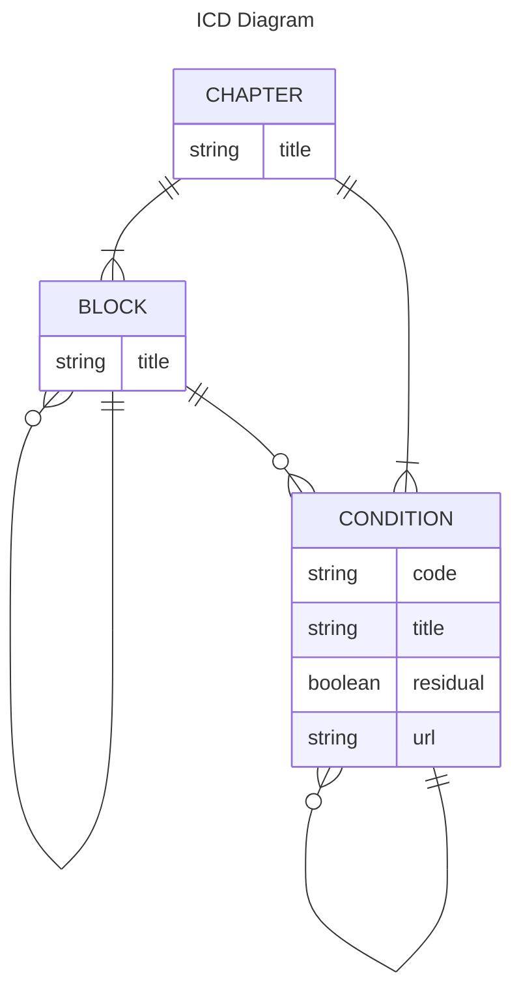

# ICD-11 Application

An application written in [Flutter](https://flutter.dev/) for offline browsing [ICD-11](https://icd.who.int/en) (International Classification of Diseases 11th Revision).

## WHO ICD-11

Official Page
- https://icd.who.int/en

App Browser
- https://icd.who.int/browse/2024-01/mms/en

Spreadsheet (en)
- https://icdcdn.who.int/static/releasefiles/2024-01/SimpleTabulation-ICD-11-MMS-en.zip

# Database

## ER 


## Import the spreadsheet data into a SQLite database

### Python setup
```
sudo apt install python3-venv python3-pip
python3 -m venv ~/.venv
source ~/.venv/bin/activate
```

### Parse ICD-11 raw data
```sh
python3 parser.py SimpleTabulation-ICD-11-MMS-en.txt
```

### Init DB
```sh
sqlite3 icd-en.db -init create-db.sql
```

### Populate DB
```sh
sqlite3 icd-en.db -init SimpleTabulation-ICD-11-MMS-en.sql
```

### SQLite GUI
```sh
sqlitebrowser icd.db
```

# Flutter App

## Create and run a new Flutter app
```sh
flutter create app_icd11
cd app_icd11
flutter pub add sqlite3
flutter pub add flutter_fancy_tree_view
flutter pub add url_launcher

flutter run
```

## Running standalone App
Make sure the database file `icd-en.db` exists in the directory the executable is launched from.

```sh
cd app_icd11
./build/linux/x64/debug/bundle/app_icd11
```
