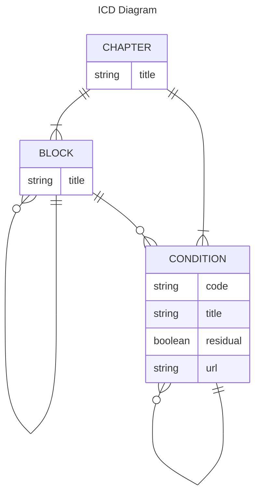

# ICD-11 Application

This is [CS50](https://cs50.harvard.edu/x/2024/)'s final project: an application for offline browsing [ICD-11](https://icd.who.int/en) (International Classification of Diseases 11<sup>th</sup> Revision).

The World Health Organization (WHO) provides an ICD-11 spreadsheet containing the diseases names, hierarchy and their codes. This spreadsheet is parsed to create an SQL script to populate a SQLite database which is used by the application (see Section "_Import the spreadsheet data into a SQLite database_" below).

The application reads the database and allows the user to search diseases by either code or name. Users can enter a case insensitive substring for their searches at the autofocus text field. The list of diseases is filtered matching the name substring or the disease code as the user types. A button with an "X" is displayed at the right side of the text field to clear it when clicked.

When the user selects a disease from the filtered list, a detailed view is displayed along with the hierarchy, from the chapter to the selected disease.

# Tech Stack
- [Flutter](https://flutter.dev/) application framework for the [Dart](https://dart.dev/) programming language
- [Python](https://www.python.org/) script language for spreadsheet parsing
- [SQLite](https://www.sqlite.org/index.html) database

The application runs on Linux operating systems. However, the chosen stack and libraries are multi platform and should also run on Windows, Mac, Android and iOS with little effort.

# Database

## Import the spreadsheet data into a SQLite database

### Init DB
```sh
sqlite3 icd-en.db -init create-db.sql
```

### Python setup
```sh
sudo apt install python3-venv python3-pip
python3 -m venv ~/.venv
source ~/.venv/bin/activate
```

### Parse ICD-11 raw data
```sh
python3 parser.py SimpleTabulation-ICD-11-MMS-en.txt
```
The script parses the Tab separated text file and generates another file with the same name and `.sql` extension which can be imported into SQLite to populate the database as shown in the next section.

The spreadsheet used contains:
- 36044 lines
- 28 chapters
- 1353 blocks
- 34663 conditions

### Populate DB
```sh
sqlite3 icd-en.db -init SimpleTabulation-ICD-11-MMS-en.sql
```

### SQLite GUI
```sh
sqlitebrowser icd.db
```
Optionally, the SQLite browser GUI can be used to navigate and query the database.


## ER Diagram


The `Chapter` is the root abstraction, which contains blocks (`Block`) and diseases (`Condition`). Blocks group other blocks and diseases. General diseases may also have specific diseases down the hierarchy.
Conditions also have a boolean to represent the residual category (i.e. other specified or unspecified categories) and the URL to the disease at the WHO official ICD-11 online browser.

# Flutter App

## Create and run a new Flutter app
```sh
flutter create app_icd11
cd app_icd11
flutter pub add sqlite3
flutter pub add flutter_fancy_tree_view
flutter pub add url_launcher

flutter run
```

## Running standalone App
Make sure the database file `icd-en.db` exists in the directory the executable is launched from.

```sh
cd app_icd11
./build/linux/x64/debug/bundle/app_icd11
```

## Architecture

The application uses a main page for user interaction and displaying the requested information.

The data is accessed through a repository pattern which encapsulates the SQLite access and SQL statements, see `app_icd11/lib/data/icd_repository.dart`. The repository exposes through accessor methods only the models used by the application: a basic model (`BasicCondition`) and the detailed models (`Chapter`, `Block` and `Condition`).

The basic model is used to list, filter and navigate all diseases. A small data structure was chosen to optimize filtering and user interaction of more than 34,000 conditions. The detailed models are used on the detailed view and hierarchical tree view. The detailed view displays the chapter number and description, disease code, name, block, general disease name if it has one and the URL to the WHO official ICD-11 browser if the user has Internet access. The tree view displays the disease hierarchy, from the chapter it is located to the disease itself and its blocks/general diseases.

The application follows the system theme (light or dark) and uses standard Material UI Flutter components and icons to implement specialized widgets. Callbacks are used to react to user input and state change.

### External dependencies
The application depends on the following external libraries (see `app_icd11/pubspec.yaml`):
- `sqlite3` for native database access and control
- `flutter_fancy_tree_view` to display the `IcdTreeView` widget disease hierarchy
- `url_launcher` to open the official WHO ICD-11 browser

# WHO ICD-11

Official Page
- https://icd.who.int/en

App Browser
- https://icd.who.int/browse/2024-01/mms/en

Spreadsheet (en)
- https://icdcdn.who.int/static/releasefiles/2024-01/SimpleTabulation-ICD-11-MMS-en.zip